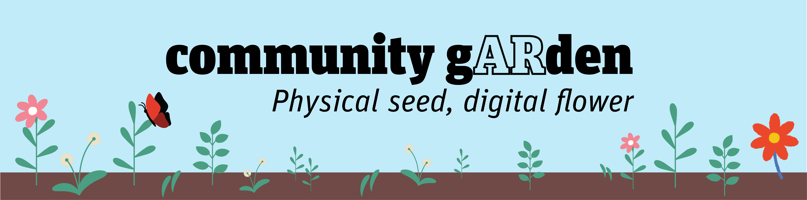

# community gARden

community gARden is a collaborative, immersive gardening experience. This hybrid physical-digital environment invites users to plant a seed in a physical flower pot and add it to a digital scene. When the user adds sunlight and water through their physical interactions, a unique flower grows in the pot. The user can take their physical pot home with them and grow their seed in the physical environment as well. 

[YouTube video](https://www.youtube.com/watch?v=Uu0esk5MVyg)

This immersive experience was designed for exhibition at the 2021 Jacobs Winter Design Showcase at UC Berkeley. The immersive environment was designed in Unity, motion tracking and detection was accomplished with two Kinect V2 cameras, and used RoomAlive Toolkit from Microsoft to pull the Kinect data into Unity. We used two projectors in the space to minimize shadows and two Kinect cameras to avoid occluding body parts to maximize body tracking.
